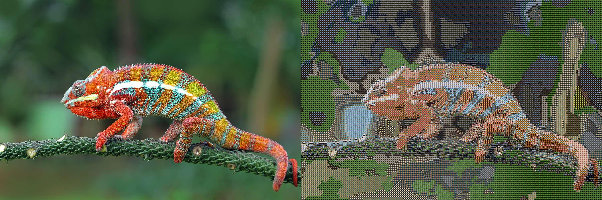

# Photographic-Mosaic
Create a Photomosaic using color similarity.

You can also play with the target´s image opacity to get a more similar picture.

Using a picture and a folder with other input pictures this tool will create a picture that has been divided into equal
sized tiled sections, each of which is replaced with another photograph that matches the target photo.
